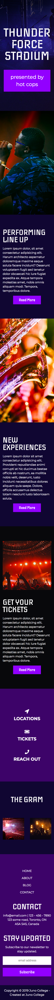

## PSD Design Conversion

The goal of this project was to convert a provided PSD design into a functional, responsive website. This was accomplished by using CSS floats. 

## Screenshots 
### Desktop Layout 

### Mobile Layout

